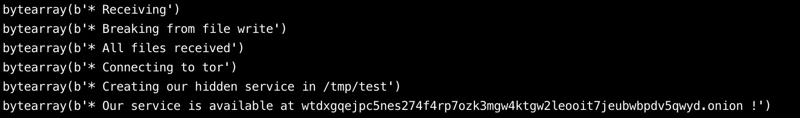

# Artifact Evaluation

### **Experimentation**

- **Anonymity Metrics**:
  
  To measure the level of anonymity a client achieves by using CenTor, we utilize a set of scripts (explained below). The anonymity is assessed by calculating the *entropy*, which reflects the distribution of clients across different geographical locations, Autonomous System Numbers (ASNs), and countries. This allows us to quantify how well CenTor maintains client anonymity in a region selected by the client.

- **Latency**:

  We examine the impact of CenTor on latency by comparing file download times across three different configurations:

  1. **Vanilla Tor**: This uses a standard 6-hop Tor circuit (6 relays between the client and the server).
  2. **CenTor without region selection**: A Tor circuit where CenTor reduces the number of hops by 3 (i.e., a 3-hop Tor circuit without prioritizing geographical proximity).
  3. **CenTor with region selection**: A 3-hop CenTor circuit where the client selects a geographically closer region (or shadow) for the relays, further optimizing latency.

---

### **Scripts** 
### **Data Generation Scripts (`/src/data`)**

These scripts are used to generate the necessary data for evaluating the performance of CenTor.

- **`users.py`**:

  This script divides IPs across ASNs in proportion to the total number of users in each country. For example, if an ASN in a country contains 40% of the total IPs, and the country has 100 users (based on `users.txt`), that ASN is assigned 40 users in the output file `\\data\\generated\\<country_final.txt>`.

- **`country.py`**:

  Generates the list of Tor relays available in each country. This helps define the network layout for experimentation.

- **`entry_node.py`**:

  Produces a list of entry nodes (the first hop in a Tor circuit) per country, which is critical for understanding the distribution of entry points into the Tor network.

- **`exit_node.py`**:

  Generates a list of exit nodes (the last hop in a Tor circuit) for each country, which is used to determine how traffic leaves the Tor network.

### **Metric Calculation Scripts (`/src/metrics`)**

These scripts calculate various performance metrics that are used to analyze anonymity and relay density in a region chosen by a client.

- **`country_entropy.py`**:

  Computes the *entropy* of client distribution across different countries in a given region (or shadow). This metric quantifies how spread out the clients are across countries and indicates the level of anonymity.

- **`asn_entropy.py`**:

  Similar to `country_entropy.py`, this script calculates the entropy of client distribution across ASNs (network operators) in a given region. A higher entropy indicates a more diverse distribution, contributing to better anonymity.

- **`relay_density.py`**:

  Measures the density of Tor relays in a specific region. This helps understand how many relays are available in a particular geographic area, which can impact latency and anonymity.

- **`entry_density.py`**:

  Computes the density of entry relays in a selected region, helping analyze how distributed the initial connection points are in the Tor network.

- **`exit_density.py`**:

  Similar to `entry_density.py`, this script measures the density of exit relays, which is important for evaluating where traffic exits the network and impacts the performance and anonymity of the service.

---

### **Data Files**

### **Tor Data**

- **`users.txt`**:

  Contains the number of Tor users per country as of April 23, 2021, (data gathered from [Tor Metrics](https://metrics.torproject.org/userstats-relay-country.html)).

- **`entry.txt`**:

  Contains the number of Tor entry nodes available in each country, generated using `entry_node.py`.

- **`exit.txt`**:

  Contains the number of Tor exit nodes available in each country, generated using `exit_node.py`.

### **ASN Data**

- **`\\data\\<country_asn.txt>`**:

  Lists the number of IP addresses associated with each ASN in a specific country. This data is retrieved from [ipinfo.io](https://ipinfo.io/countries).

- **`\\data\\generated\\<country_final.txt>`**:

  This file stores the final number of users distributed proportionally across ASNs based on the total number of users in a country, as generated by `users.py`.

- **`relay_data.txt`**:

  Contains data about the number of Tor relays in each country, generated using `country.py`.

---

### **ARTIFACT: Testing CenTor**

### **Server-Side Setup**

1. Ensure that `apache2` is installed and running on the server.
2. Verify that the Tor service is active.
3. Start the Bento server by navigating to the appropriate directory and running the following command:

    ```bash
    sudo ./runserver.py
    ```

### **Client-Side Setup**

1. Ensure that the `centor.func` file has the correct listening address and port. If the client is connecting from outside `localhost`, set the listening address to `0.0.0.0`.
2. Upload the CenTor server as a Bento function by running the `bento-driver.py` script:

    ```bash
    python3 bento-driver.py <bento_address> <port>
    ```

3. Ensure that `client_ftp.py` is configured with the correct connection address.
4. To connect to the function, use the following commands:

    ```bash
    cd setup
    python3 client_ftp.py
    ```

---

### **Artifact Evaluation: CenTor**


This section details how to evaluate the performance and configuration of CenTor on the Bento infrastructure. We will guide you through the setup process, running simulations, and debugging steps necessary to test CenTor in various configurations.

### **Login Information**

- **Login**: (This will be provided by the reviewer)
- **Password**: (This will be provided by the reviewer)

### **Setup Instructions**

The evaluation process requires you to interact with four terminal windows on the Bento server. Follow these steps closely:

1. **First Terminal - Run Tor:**

    - In the first terminal, start the Tor service. This will establish the core functionality required for Onion Service testing.
    - Use the following command to start Tor:

        ```bash
        tor
        ```

2. **Second Terminal - Start the Bento Server:**

    - In the second terminal, navigate to the Bento server directory and start the Bento server.
    - Change to the Bento server directory:

        ```bash
        cd Bento/bento/server
        ```

    - Start the Bento server with root privileges:

        ```bash
        sudo ./runserver.py
        ```

    This command initiates the Bento server, which hosts the CenTor functions required for further testing.

3. **Third Terminal - Upload and Run `centor.func`:**

    - In the third terminal, navigate to the CenTor directory where the function is stored and upload the `centor.func` to the Bento server. This function simulates the CenTor operation on the server.
    - Change to the CenTor testing directory:

        ```bash
        cd Bento/testing/CenTor
        ```

    - Use the following command to upload and execute the function, specifying the Bento server's address and port (default: `0.0.0.0` and port `8888`):

        ```bash
        python3 bento_driver.py 0.0.0.0 8888
        ```

4. **Fourth Terminal - Transfer Service Files:**

    - In the fourth terminal, navigate to the setup directory and transfer the service files to the Bento server. This involves using the `client_ftp.py` script to simulate file transfer to the server.
    - Change to the setup directory:

        ```bash
        cd Bento/testing/CenTor/setup
        ```

    - Run the FTP client script:

        ```bash
        python3 client_ftp.py
        ```

    - Sample input for file transfer might look like this:

        ```bash
        1, test, test/, index.html
        ```

    This input indicates transferring the file `index.html` to the `/test/` directory under the `test` service.

    The new CDN onion address will be displayed as shown below.

    

---

### **Debugging Steps**

If issues arise during setup or operation, follow these debugging instructions to troubleshoot:

1. **Check Apache Configuration Files:**
    - Verify that the Apache configuration files are correctly set up. The key configuration files to check are:
        - `/etc/apache2/sites-available/test.conf`: This file defines virtual host settings.
        - `/etc/apache2/apache2.conf`: This is the main Apache configuration file that should include or reference the virtual host settings.

2. **Check `centor.func` Directory Setup:**
    - Ensure that the `centor.func` script is correctly creating necessary directories for file storage. Double-check the paths and permissions to make sure the script has access to create and manage directories.

3. **Reload Apache Service:**
   - If changes are made to Apache configuration files, or if there are issues with loading the function, restart the Apache service to apply the changes:
     
     ```bash
     sudo systemctl restart apache2
     ```

4. **Run the Server Script with Root Privileges:**
   - If there are issues related to permissions or service access, try running the server script with `sudo` to ensure it has adequate permissions.

5. **Remove Temporary Test Directory:**
   - If there are errors related to hostnames or keys, particularly if a previous test failed, clear the `/tmp/test/` directory and retry the test:
     
     ```bash
     sudo rm -r /tmp/test
     ```

---

### **Apache Setup Overview**

If further Apache configuration is needed, here are the critical paths:

1. **Root Directory for Website Files:**
   - The primary location for Apache website configuration is found in `/etc/apache2/apache2.conf`.

2. **Website Configuration Files:**
   - Virtual host configurations for the CenTor service are stored in `/etc/apache2/sites-available/test.conf`.

---

### **Hidden Service Configuration**

The Onion Service created for this evaluation uses a temporary directory for storing hostnames and keys:

- **Hostname and Key Storage**:  
  Located in `/tmp/test/`, this directory stores the hostname and key files required for Tor’s hidden services. This should be monitored and managed carefully during the setup.

For more information on Apache virtual hosts and how to configure them, refer to the official guide:  
[Virtual Host Configuration Guide](https://www.liquidweb.com/kb/configure-apache-virtual-hosts-ubuntu-18-04/)

---

### **Shadow Simulations**

Simulating network scenarios for CenTor requires the use of the Shadow simulator. This is a resource-intensive process, so we recommend simulating at a reduced scale (e.g., `0.2` of the network).

### **Downloading and Configuring Shadow:**

- Shadow can be downloaded from GitHub:  
  [Shadow Repository](https://github.com/shadow/tornettools)

- Once downloaded, configure it according to the scenarios described in section 5.2 of the documentation.

**Simulation Scenarios:**
Note: *Our simulations used 100% of the Tor Network which is highly resource intensive. We recommend replicating these scenarios to 10-30% of the Tor network.*

a. **Baseline Experiment**:

Install Bento on 25% of the Tor relays and compare its performance to a setup where Bento is installed on 50% of the relays.

- Download Bento and add the `./runserver` and `/tgen` command to each node to simulate Bento traffic.
- Modify `shadow.config.yaml` to replicate the experiment.
- Ensure consistency in the number of Bento nodes for each experimental run to maintain accuracy.

b. **Multiple Clients Connecting to a Single CenTor Instance**:

Set up 25% of the clients to connect to the same relay/Bento node by changing the IP in the TGen file. Compare the performance of clients connected to the relay versus clients not connected. For accurate results, ensure the `torrc` file of the Bento node is set to non-anonymous so that clients use a 3-hop circuit.

c. **Multiple CenTor Instances on a Single Tor Relay**:

Increase the number of instances running on a single relay by adjusting the "then" count (e.g., increase to 10). Compare the performance of these multiple instances against a generic relay setup.

d. **Shadow-Aware Routing**:

Configure 10% of the clients to connect to a Bento relay (set to non-anonymous, mimicking CenTor), but restrict routing to North American relays only. This can be achieved by adjusting the client’s `torrc` configuration file. Compare this setup to a generic Tor client routing setup, and observe how it impacts both client and relay performance.

---

### **Scripts to Test the Performance of CenTor Clients**

In this section, we will guide you through the process of testing the performance of CenTor clients using scripts from the CenTor GitHub repository(`/CenTor/experiments/scripts`). Please note that these tests require Tor to be installed on your system. The primary goal is to evaluate CenTor in different scenarios, such as region-based relays and varying anonymity configurations.

### **Prerequisites:**

- **Tor Installed**: Ensure Tor is properly installed and configured on your machine. This is necessary for testing CenTor services and clients.
- **Modify `torrc` Configuration**: You will need to modify the Tor configuration file (`torrc`) to test different regions and anonymity settings, as explained in the instructions below.

---

### **Key Notes Before Testing:**

- **Region-Specific Relays**:  
  For CenTor tests, you can restrict relays to specific regions. For example, if you want to limit the CenTor client to use relays within Europe, modify the `torrc` file accordingly. By default, Tor will route traffic through a global set of relays, but CenTor allows you to focus on specific regions.

- **Non-Anonymous vs Anonymous Services**:  
  In CenTor, the service is **non-anonymous**, allowing for better performance and fewer hops. In contrast, the generic Tor Onion Service operates as **anonymous**, prioritizing privacy by adding more hops to the circuit. You will need to update the `torrc` file to reflect these differences when testing.

---

### **Scripts Overview:**

Here are the key scripts used for evaluating the performance of CenTor clients and services:

1. **`centor_client.py`**:  
   This script is designed to simulate the behavior of a CenTor client. It connects to the CenTor service and tests how the client performs when utilizing non-anonymous, region-restricted relays.

   **Usage**: This script helps in analyzing how a client using CenTor performs compared to generic Tor clients in terms of latency, throughput, and relay availability.

2. **`centor_service.py`**:  
   This script is used to launch the CenTor service. The CenTor service differs from traditional Onion Services in that it operates without the anonymity requirement, reducing the number of hops and optimizing for performance.

   **Usage**: Run this script to start the CenTor service before connecting clients (using `centor_client.py`). This script is crucial for setting up the non-anonymous service for testing.

3. **`client.py`**:  
   This script represents a **generic Tor client**. It simulates a typical Tor user interacting with an Onion Service, utilizing the default 6-hop, anonymous Tor circuit.

   **Usage**: Use this script to compare the performance of a standard anonymous client against CenTor. This will help highlight the differences in latency, bandwidth, and anonymity between a generic Tor client and a CenTor client.

4. **`client_without_la.py`**:  
   This script tests a **Tor client without relays in a specific shadow** or region. It simulates the behavior of a client whose traffic is routed through a less-optimized relay network, either by excluding certain regions or by modifying the number of available relays.

   **Usage**: This script is useful for testing how performance changes when specific regions or relays are excluded from the client’s routing path. This simulates a scenario where clients have fewer relay choices, which impacts both latency and anonymity.

### **Modifying the `torrc` File for Region-Specific Relays:**

To focus the CenTor client on specific regions (e.g., Europe), you need to configure the `torrc` file to limit the selection of relays. Here’s how to do it:

1. **Locate the `torrc` file**:
   - On most systems, the `torrc` file is located in `/etc/tor/torrc` or `~/.torrc` (depending on your OS and installation method).

2. **Edit the `torrc` file**:
   - Open the `torrc` file in a text editor.
   - Add the following configuration to restrict relays to a specific region (e.g., Europe):
   This configuration forces Tor to only use entry and exit nodes in Europe.
   
     ```bash
     EntryNodes {eu}
     ExitNodes {eu}
     StrictNodes 1
     ```

3. **Non-Anonymous CenTor Service**:
   - For CenTor testing, set the service to **non-anonymous** by removing the default Tor anonymity settings. Ensure that the configuration in `torrc` reflects this by adjusting the hop count and other related parameters:
   This minimizes hops and avoids strict anonymity settings, making CenTor more performance-optimized.

4. **Generic Tor Onion Service**:
   - For comparison, revert back to the default **anonymous** Tor configuration for the generic client tests. This ensures that the standard Onion Service uses a full 6-hop circuit.

---

### **Running the Scripts**:

Once the `torrc` file is configured, follow these steps to run the scripts:

1. **Launch the CenTor Service**:
   - First, run `centor_service.py` to start the CenTor service.
   - Command:
   
     ```bash
     python3 centor_service.py
     ```

2. **Test CenTor Client**:
   - After the CenTor service is running, use `centor_client.py` to test the CenTor client.
   - Command:
   
     ```bash
     python3 centor_client.py
     ```

3. **Test Generic Tor Client**:
   - To compare the performance of a standard Tor client, run `client.py`.
   - Command:
   
     ```bash
     python3 client.py
     ```

4. **Test Client Without Region-Specific Relays**:
   - For a scenario where the client is not restricted to specific relays, use `client_without_la.py`.
   - Command:
   
     ```bash
     python3 client_without_la.py
     ```

---

### **Summary of Tests:**

- **CenTor Client (`centor_client.py`)**: Simulates a performance-optimized, non-anonymous client connected to a specific region.
- **CenTor Service (`centor_service.py`)**: Hosts the CenTor service for non-anonymous, region-optimized testing.
- **Generic Tor Client (`client.py`)**: Represents the standard, anonymous Tor client for comparison.
- **Tor Client Without Region Restrictions (`client_without_la.py`)**: Tests how performance degrades when region-specific relay restrictions are not applied.

---

### **Results for CenTor Experiments**

The following links provide access to the results and performance graphs for the CenTor experiments:

1. **Figure 18 Results**:
   The results for **Figure 18** can be found in the CenTor repository under the directory `exp_exit`. These results focus on the exit relay performance under different configurations and scenarios.
   
   Results for Fig 18: (`CenTor/experiments/exp_exit`)

2. **Figure 3 Results**:
   The results for **Figure 3** are available in the repository under the `results` directory.
   
  Results for Fig 3: `CenTor/experiments/results`

3. **Figure 14 Visualization (Colab)**:
   You can visualize the data and results for **Figure 14** through this Colab notebook.
   
   [Figure 14 Visualization](https://colab.research.google.com/drive/1GnkIJ5XpNOxO-gVcWZ6gTgIiimobirBt?usp=sharing)

4. **Scripts for Plotting Performance Graphs (Colab)**:
   The scripts used to plot performance graphs can be accessed and executed via this Colab notebook.
   
   [Plotting Scripts](https://colab.research.google.com/drive/15sVt-dnaWF9IOzHJFhP-xdirBH5tFPBu?usp=sharing)

5. **Multipath Routing Experiments**:
   The repository also includes multipath routing experiments under the `uTor` directory. These experiments explore how multipath routing affects the performance of Onion Services by leveraging multiple circuit paths to improve reliability and reduce latency.
   
   Multipath Routing Experiments: `Centor/uTor`

---

### **Experimentation Steps**

To test uTor under various configurations and settings, follow these detailed steps:

1. **Running `fingerprints.py` Script**:
   - The `fingerprints.py` script is used to generate an `exclude` file, which lists the top one-eighth of the fastest relays in the Tor network. These fast relays are excluded during experimentation to simulate more realistic, low-bandwidth network conditions.
   - We launch Tor with the `StrictNodes=0` option, which allows us to use relays outside the excluded list without fully eliminating these faster resources.
   - [Refer to the Tor manual for more details](https://2019.www.torproject.org/docs/tor-manual.html.en).

2. **Launching the Onion Service**:
   - We use a customized `torrc` file to launch the Onion Service. The configuration is provided at run-time in the Python script `utor_launch_service.py`.
   - This configuration is designed to favor low-bandwidth Tor relays, which makes the network topology more representative of a real-world scenario where high-bandwidth relays are not always available.

3. **uTor Client Setup**:
   - On the client side, we follow a similar approach to prioritize low-bandwidth relays in the circuit construction. The configuration is applied through the client’s `torrc` file.

4. **Data Retrieval Using Multiple Circuits**:
   - The client script (`uTor.py`) retrieves data from the Onion Service using **threads** to simulate multipath data retrieval. Each thread requests data through different circuits or paths, ensuring that we test the reliability and performance of the service under these conditions.

5. **Organizing Data on the Client Side**:
   - Once the data is retrieved, the client organizes it by forcing the threads to execute in a sequential order (scheduling). This ensures that the data from different circuits can be handled and processed in a consistent manner.

6. **New-Circuit Creation with `MaxCircuitDirtiness`**:
   - In the `torrc` file, we set the `MaxCircuitDirtiness NUM` option to force the creation of a new circuit after a certain amount of time (NUM seconds). This prevents circuits from becoming too "stale" and ensures that each test uses fresh circuits for performance evaluation.

7. **Running `uTor` as a Function with Bento**:
   - In addition to manual testing, `uTor` can be deployed as a function with Bento. This provides additional flexibility and scalability for running experiments on larger datasets or in different network environments.

---

### **Summary of Experimentation**

- **`fingerprints.py`**: Generates an exclude list of top fast relays to simulate more realistic network conditions by removing high-performance relays.
- **Customized `torrc`**: Used for both the Onion Service and client-side to prioritize low-bandwidth relays and create a real-world testing environment.
- **`uTor.py`**: Retrieves data via multiple circuits, simulating a multipath routing approach.
- **Data organization**: Ensures data from different circuits is processed in a controlled manner using thread scheduling.
- **`MaxCircuitDirtiness`**: Forces circuit renewal, keeping circuit conditions fresh during long-running experiments.
- **`uTor` as a Bento function**: Allows CenTor testing and experimentation at scale.

References:

1. Bento GitHub: [https://github.com/breakerspace/bento](https://github.com/breakerspace/bento)
2. Shadow GitHub: [https://github.com/shadow/tornettools](https://github.com/shadow/tornettools)

